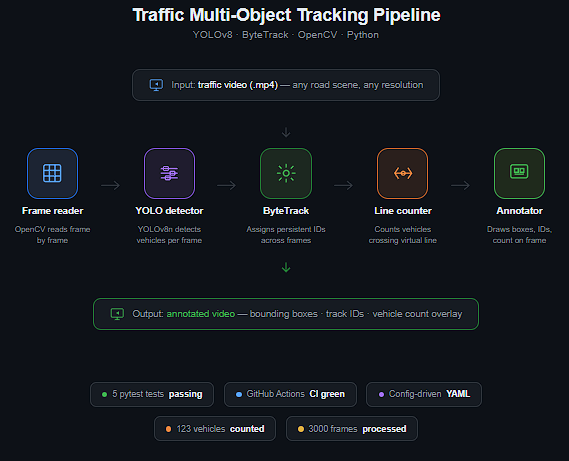
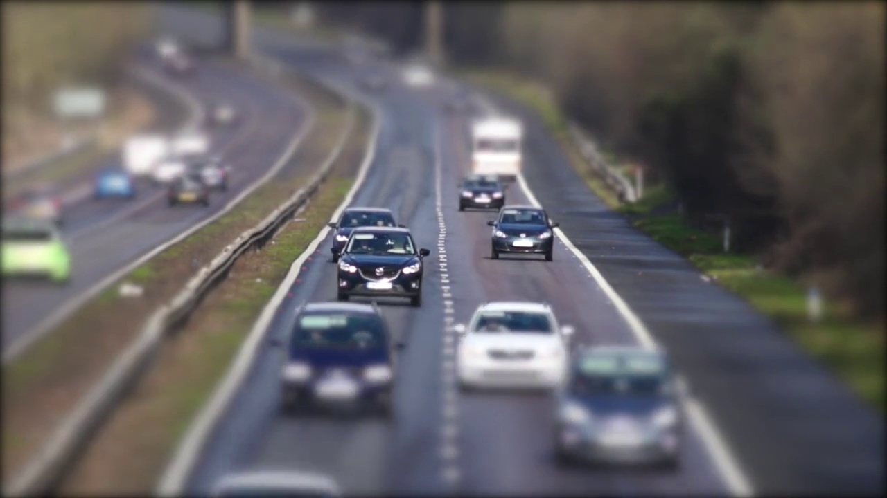
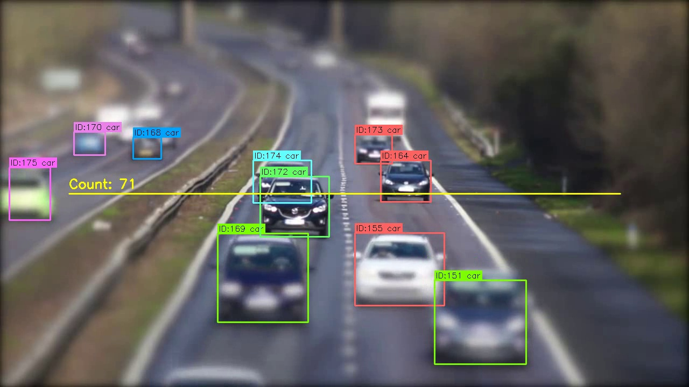

# Traffic Multi-Object Tracking

> Real-time vehicle detection, tracking, and counting in traffic video using **YOLOv8** and **ByteTrack**.


---

## Overview

This project extends single-frame object detection into **video-based dynamic perception** — a core requirement in autonomous driving and intelligent transport systems.

Given a traffic video, the pipeline:
- **Detects** vehicles frame-by-frame using YOLOv8
- **Tracks** each vehicle across frames with a persistent ID using ByteTrack
- **Counts** vehicles crossing a configurable virtual line
- **Outputs** a fully annotated video with bounding boxes, class labels, track IDs, and live count

---

## Pipeline Architecture

<p align="center">
  
</p>
The pipeline processes each video frame sequentially:

- **YOLOv8 Detector** – Runs object detection to obtain bounding boxes for vehicles (cars, trucks, buses, etc.) with confidence scores.
- **ByteTrack** – Associates detections across frames using a Kalman filter and matching strategy, assigning a unique ID to each tracked vehicle.
- **Line Counter** – Checks each tracked vehicle's centroid against a predefined virtual line; increments count when a vehicle crosses.
- **Annotator** – Draws bounding boxes, track IDs, class labels, and the current count on the output frame.

---
## Input / Output

| Input Frame | Output Frame |
|---|---|
|  |  |

> Frame 1550 — 14 vehicles tracked simultaneously with unique IDs and count overlay

---

## Project Structure
```
traffic-mot/
├── src/
│   ├── detector.py        # YOLOv8 wrapper
│   ├── tracker.py         # ByteTrack wrapper
│   ├── analytics.py       # Line crossing counter
│   ├── annotator.py       # Frame drawing
│   └── pipeline.py        # End-to-end orchestrator
├── configs/
│   └── default.yaml       # All settings
├── tests/
│   └── test_analytics.py  # pytest unit tests
├── .github/workflows/
│   └── ci.yml             # GitHub Actions CI
├── docs/                  # Pipeline diagram and demo frames
└── run_tracker.py         # CLI entry point
```

---

## Setup
```bash
git clone https://github.com/SHIVCHAUDHARY17/traffic-mot.git
cd traffic-mot
python -m venv venv
venv\\Scripts\\activate
pip install -r requirements.txt
```

---

## Usage
```bash
python run_tracker.py --config configs/default.yaml
```

Output saved to `outputs/tracked.mp4`

---

## Configuration
```yaml
model:
  weights: yolov8n.pt
  confidence: 0.3
  classes: [2, 3, 5, 7]

analytics:
  counting_line:
    start: [0.1, 0.5]
    end: [0.9, 0.5]
```

---

## Results

| Metric | Value |
|---|---|
| Video length | 3000 frames |
| Vehicles counted | 123 |
| Max tracked simultaneously | 14 |
| Model | YOLOv8n (nano) |

---

## Testing and CI
```bash
py -m pytest tests/ -v
```

5 unit tests — no crossing, single crossing, double-count prevention, multiple vehicles, above-line filtering.
GitHub Actions runs all tests on every push automatically.

---

## Tech Stack

| Component | Tool |
|---|---|
| Object detection | YOLOv8n (Ultralytics) |
| Multi-object tracking | ByteTrack (BoxMOT) |
| Video processing | OpenCV |
| Testing | pytest |
| CI/CD | GitHub Actions |

---

## Limitations

- Track IDs reset if a vehicle re-enters the frame
- Counting line is fixed per run
- Occlusion can cause brief ID switches

---

## Author

**Shiv Jayant Chaudhary** — Computer Vision and Machine Learning Engineer

[](https://linkedin.com/in/shiv1716)
[](https://github.com/SHIVCHAUDHARY17)
"""
